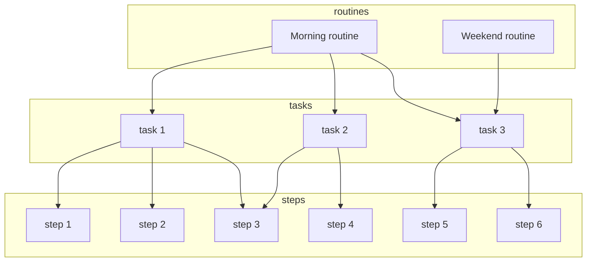

```mermaid
graph
  subgraph "routines"
    mr["Morning routine"]
    wr["Weekend routine"]
  end
  subgraph "tasks"
    t1["task 1"]
    t2["task 2"]
    t3["task 3"]
  end
  subgraph "steps"
    s1["step 1"]
    s2["step 2"]
    s3["step 3"]
    s4["step 4"]
    s5["step 5"]
    s6["step 6"]
  end
  
  mr --> t1 & t2 & t3
  wr --> t3
  
  t1 --> s1 & s2 & s3
  t2 --> s3 & s4
  t3 --> s5 & s6
```
